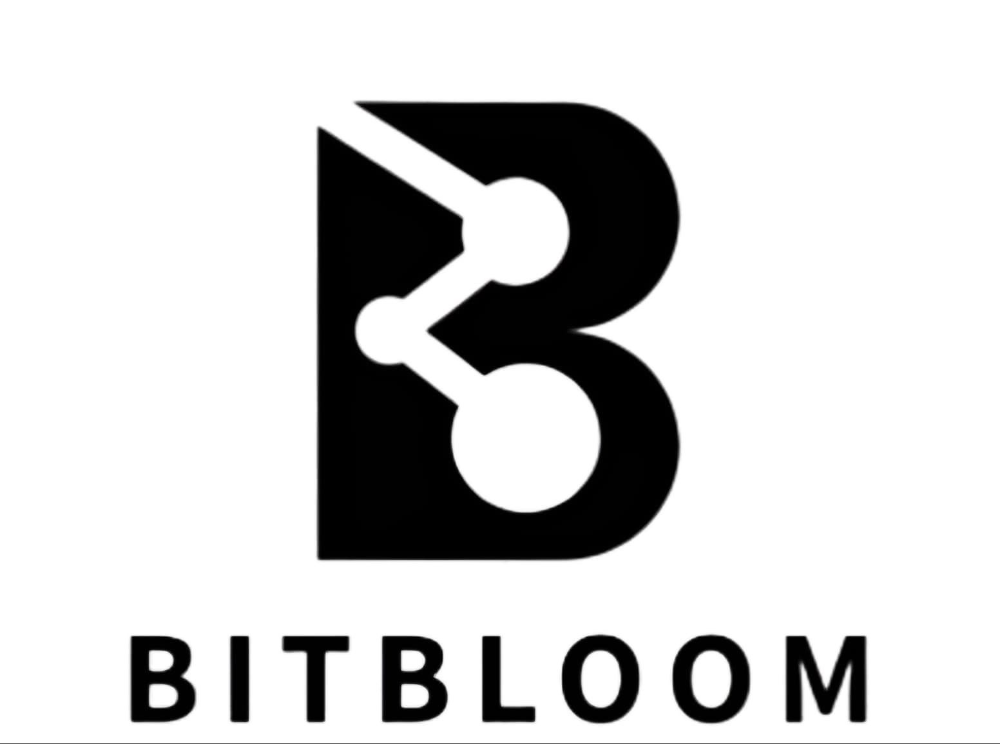

# BitBloom – Empowering Developers & Creators

  
  
<strong>Connect, Create, Collaborate, and Monetize</strong>

  

  
  
  
  

---

## 🚀 Live Demo

- **Frontend**: [https://bit-bloom.netlify.app/](https://bit-bloom.netlify.app/)
- **Backend API**: [https://bitbloom-1zw8.onrender.com](https://bitbloom-1zw8.onrender.com)

---

## 📌 About BitBloom

BitBloom is a comprehensive ecosystem designed to bridge the gap between developers, creators, and the broader tech community. Our mission is to provide a platform where:g

- **Developers** can showcase their skills, solve real-world problems, and contribute to open-source projects
- **Creators** can monetize their digital products, from UI kits to educational resources
- **Open-source maintainers** can find willing contributors for their projects
- **Learners** can grow through practical challenges and access quality resources

BitBloom was created to address the fragmentation in the developer ecosystem, where talented individuals often lack exposure, monetization channels, or meaningful contribution opportunities.

---

## 🛠 Tech Stack

### Frontend
- **Framework**: React 19 with TypeScript
- **Build Tool**: Vite
- **State Management**: React Context API
- **Routing**: React Router v7
- **Styling**: Bootstrap 5 & CSS Modules
- **Authentication**: JWT & Google OAuth
- **HTTP Client**: Axios

### Backend
- **Runtime**: Node.js
- **Framework**: Express.js with TypeScript
- **Database**: MongoDB with Mongoose ODM
- **Authentication**: JWT, bcrypt
- **File Storage**: Cloudinary + Multer
- **API Documentation**: Bruno Collection

### DevOps
- **Frontend Hosting**: Netlify
- **Backend Hosting**: Render
- **Version Control**: Git & GitHub

---

## ✨ Key Features

- **User Authentication System**
  - Email/Password Registration & Login
  - Google OAuth Integration
  - JWT-based Authentication

- **Resource Marketplace**
  - Upload Digital Resources (PDFs, UI Kits, Templates)
  - Free & Paid Resource Options
  - Secure Resource Downloads

- **Open Source Contribution Portal**
  - Browse Available Issues
  - Submit Solutions
  - Track Contribution History

- **Coding Challenges**
  - Various Difficulty Levels
  - Multiple Categories
  - Performance Metrics

- **Project Collaboration**
  - Post Projects for Collaboration
  - Find Collaborators
  - Track Project Progress

---

## 🚦 Getting Started

### Prerequisites
- Node.js (v18+)
- npm or yarn
- MongoDB (local or Atlas)

### Installation

1. **Clone the repository**
   bash
   git clone https://github.com/kalviumcommunity/S64_HardikTailor_Capstone_BitBloom
   cd BitBloom
   

2. **Set up backend**
   bash
   cd backend
   npm install
   
   
   Create a `.env` file with the following variables:
   
   PORT=5000
   MONGODB_URI=your_mongodb_connection_string
   JWT_SECRET=your_jwt_secret
   CLOUDINARY_CLOUD_NAME=your_cloudinary_cloud_name
   CLOUDINARY_API_KEY=your_cloudinary_api_key
   CLOUDINARY_API_SECRET=your_cloudinary_api_secret
   

3. **Set up frontend**
   bash
   cd ../client
   npm install
   
   
   Create a `.env` file with:
   
   VITE_API_BASE_URL=http://localhost:5000
   VITE_GOOGLE_CLIENT_ID=your_google_client_id
   

4. **Run the application**
   
   In the backend directory:
   bash
   npm run dev
   
   
   In the client directory:
   bash
   npm run dev
   

5. **Access the application**
   - Frontend: http://localhost:5173
   - Backend API: http://localhost:5000

---

## 📁 Project Structure

BitBloom/
├── backend/
│   ├── src/
│   │   ├── config/          # Database configuration
│   │   ├── controller/      # Request handlers
│   │   ├── middleware/      # Custom middleware
│   │   ├── models/          # MongoDB schemas
│   │   ├── routes/          # API routes
│   │   ├── utils/           # Helper functions
│   │   └── server.ts        # Express app initialization
│   ├── .env                 # Environment variables (create this)
│   └── package.json         # Backend dependencies
│
├── client/
│   ├── src/
│   │   ├── assets/          # Images, fonts, etc.
│   │   ├── components/      # Reusable UI components
│   │   ├── hooks/           # Custom React hooks
│   │   ├── pages/           # Page components
│   │   ├── styles/          # CSS and style modules
│   │   ├── App.tsx          # Main app component
│   │   └── main.tsx         # Entry point
│   ├── .env                 # Environment variables (create this)
│   └── package.json         # Frontend dependencies
│
└── README.md                # Project documentation

---

## 🤝 Contributing

We welcome contributions to BitBloom! If you'd like to contribute, please follow these steps:

1. **Fork the repository**

2. **Create a feature branch**
   bash
   git checkout -b feature/amazing-feature
   

3. **Commit your changes**
   bash
   git commit -m 'Add some amazing feature'
   

4. **Push to the branch**
   bash
   git push origin feature/amazing-feature
   

5. **Open a Pull Request**

### Contribution Guidelines

- Follow the existing code style and conventions
- Write clear, descriptive commit messages
- Include comments in your code where necessary
- Update documentation for any new features
- Add tests for new functionality when possible

---

## 📅 Development Timeline

### ✅ **Week 1: Research, Design, and Project Setup**
- Research similar platforms
- Define features, user personas, and user flow
- Create low-fidelity wireframes and convert them into high-fidelity Figma designs
- Initialize backend with **Node.js + Express + TypeScript**
- Connect MongoDB and define schemas: `User`, `Product`, `OpenSourceIssue`, `CodingProblem`

### ✅ **Week 2: Backend Development & Authentication**
- Build core REST APIs using TypeScript (Express)
- Implement JWT authentication (signup/login) with TypeScript middleware
- Integrate **Google OAuth**
- Set up Multer for file uploads (image/asset sharing)
- Test APIs with Thunder Client or Postman

### ✅ **Week 3: Frontend Development (React + TypeScript)**
- Set up React + Vite with TypeScript
- Create routes: Home, Explore, Upload, Login/Signup
- Build components in TypeScript
- Connect frontend to backend using Axios with custom hooks and interfaces
- Implement protected routes using route guards
- Style with Bootstrap and CSS modules

### ✅ **Week 4: Final Touches, Deployment & Documentation**
- Add update/delete APIs and integrate on frontend
- Deploy backend on **Render**, frontend on **Netlify**
- Full end-to-end testing
- Complete documentation: API reference, README, and Bruno collection

---

## 👏 Acknowledgments

- Special thanks to all contributors who have invested their time in improving BitBloom
- The open-source community for providing amazing tools and libraries
- All users who have provided valuable feedback

---

  
Made with ❤ by the BitBloom Team

  

    <a href="https://github.com/kalviumcommunity/S64_HardikTailor_Capstone_BitBloom/issues">Report Bug</a> ·
    <a href="https://github.com/kalviumcommunity/S64_HardikTailor_Capstone_BitBloom/issues">Request Feature</a>
  

